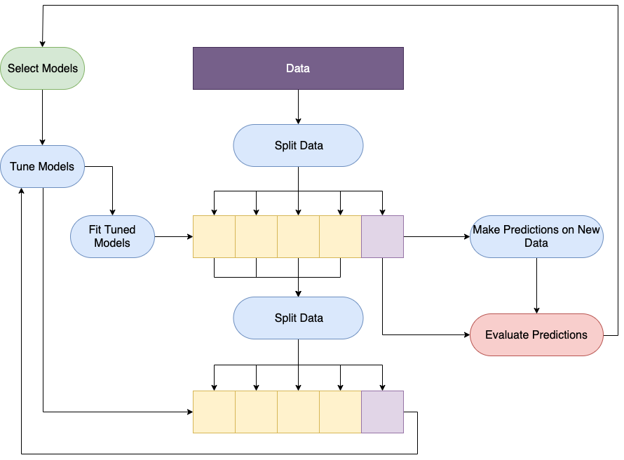

```{r,results='hide',message=FALSE,echo=FALSE}
library(mlr3)
library(mlr3pipelines)
library(mlr3learners)
library(DiagrammeR)
set.seed(1)
```

# Model Validation -  "Advanced" vs "Basic"

* Basic validation does not exist.
* 'Basic' concepts:
    * Bias-variance trade-off
    * Decomposition of mean squared error (MSE)
    * Loss minimisation
    * Loss properties - efficiency, consistency
    * Scoring rules
* An Introduction to Statistical Learning [@Hastie2013]

# Outcomes - Model Results vs Model Performance Results

> When a measure becomes a target, it ceases to be a good measure - 
Charles Goodhart/Marilyn Strathern  (1997)


# Machine Learning Framework

* Any 'classical' model fits in the ML framework
* Key difference is focus on fit/predict workflow (instead of inference and inspection)
* External Validation: Classical models require parameters/coefficients. ML requires storage, seeds, 
software versions and hyper-parameter ranges.
* Parsimony principle: If multiple models perform equally well, select the simplest. Particularly
important in ML for black-box models.

## Fit/Predict/Tune Workflow

### The wrong way to learn

```{r bad ML,echo=FALSE}
grViz("digraph {
  graph [layout = dot, rankdir = BK]
  
  node [style= filled, fixedsize = true, width = 2.5] 

  node [shape = rectangle, color = indigo, fontcolor = white] 
  rec1 [label = 'Pick favourite model']
  rec2 [label = 'Data']
  
  node [shape = oval, color = cyan, fontcolor = black]
  rec3 [label = 'Fit model to data']
  rec4 [label = 'Make predictions on data.']
  rec5 [label = 'Deploy']
  
  node [shape = oval, color = green, fontcolor = black]
  rec6 [label = 'Profit']
  
  rec1 -> rec3
  rec2 -> rec3
  rec3 -> rec4 -> rec5 -> rec6
  }", 
  height = 500)
```

### A better approach



## A Good ML Framework

1. Select a model, or multiple models
2. Depending on data size, split with cross-validation, bootstrap, or hold-out
3. Fit model(s) on training data
4. Make predictions on test data
5. Evaluate

Optionally: Split training data again for model tuning. To tune, fit models on the `nested'
training data and select hyper-parameter configuration that optimises performances on the nested
test set.

## Application: The MVP

```{r ML mvp}
# 1. Pick a model
learn = lrn("regr.lm")
# 2. Load data
task = tsk("mtcars")
print(task)
task$head()
# 3. Split data with 2/3 hold-out split
train = sample(task$nrow, 2/3 * task$nrow)
test = setdiff(seq(task$nrow), train)
# 3. Fit model to data
learn$train(task, row_ids = train)
learn$model
# 4. Make predictions on new data
pred = learn$predict(task, row_ids = test)
print(pred)
# 5. Evaluate
pred$score()
```

# Why Validate?

Arguments against validation:

* "All models are wrong" [@Box1976]
*  "...the super learner framework allows a researcher to try many prediction algorithms...
knowing that the final combined super learner fit will either be the best fit or near the best fit" [@Polley2010]

Arguments for validation:

* "...but some are useful" [@Box1976]
* Parismony Principle
* Scientific Method

## Aggregation vs. Linear Regression

```{r}
gr = Graph$new()$
  add_pipeop(po("learner", lrn("regr.svm")))$
  add_pipeop(po("learner", lrn("regr.xgboost")))$
  add_pipeop(po("learner", lrn("regr.ranger")))$
  add_pipeop(po("regravg"))$
  add_edge("regr.svm", "regravg")$
  add_edge("regr.xgboost", "regravg")$
  add_edge("regr.ranger", "regravg")
plot(gr, html = TRUE)
learn_avg = GraphLearner$new(gr)

gr = Graph$new()$
  add_pipeop(po("learner", lrn("regr.svm")))$
  add_pipeop(po("learner", lrn("regr.xgboost")))$
  add_pipeop(po("learner", lrn("regr.ranger")))$
  add_pipeop(po("learner", lrn("regr.lm")))$
  add_pipeop(po("regravg"))$
  add_edge("regr.svm", "regravg")$
  add_edge("regr.xgboost", "regravg")$
  add_edge("regr.ranger", "regravg")$
  add_edge("regr.lm", "regravg")
plot(gr, html = TRUE)
learn_avg_lm = GraphLearner$new(gr)
```

```{r,results='hide',message=FALSE}
learn_lm = lrn("regr.lm")
task = tsk("mtcars")
design = benchmark_grid(task, list(learn_avg, learn_avg_lm, learn_lm), rsmp("cv", folds = 5))
bm = benchmark(design)
```

The winner is...

```{r,echo=FALSE}
 MeasureRegrRMSESE = R6::R6Class(
   inherit = mlr3::MeasureRegr,
   public = list(
     initialize = function() {
       super$initialize(
         id = "regr.rmse_se",
         range = c(0, Inf),
         minimize = TRUE,
         predict_type = "response"
       )
     }
   ),
   private = list(
     .score = function(prediction, ...) {
       response = prediction$response
       truth = prediction$truth
         N <- length(response)
         sqresids <- (response - truth)^2
         rmse <- sqrt(mean(sqresids))
         mse.se <- sd(sqresids)/sqrt(N)
         return(mse.se/(2*rmse))
     }
   )
 )
mlr3::mlr_measures$add("regr.rmse_se", MeasureRegrRMSESE)
```
```{r}
bm$aggregate(msrs(c("regr.rmse", "regr.rmse_se")))[,c("learner_id", "regr.rmse", "regr.rmse_se")]
```

# Internal and External Validation

* Internal validation: Models are validated using the same dataset for training and testing.
* External validation: Models are validated using an external dataset.

## External Validation

External validation is the gold-standard for evaluation as not only is the data completely unseen
and new to the model, but the underlying data-generation process may even be different. If data
is trained and tested on the exact same data then no indication is given to how the model may
perform on new data. In general a model's training performance does not correlate with its testing
performance. Moreover, without external validation, there is no way to tell if your dataset is
even representative, which can lead to strange results...

### Case-Study: An Unimportant Example

The TOT model [@Tan1997]:
$Y = 88.1 + 0.51X$
where $Y$ is ear circumference (mm) and $X$ is age (years).

Their conclusion:

"In any event, this knowledge may be useful for forensic scientists and can be an alternative to dental records in the future. It may be speculated that if Van Gogh's ear had been fossilized, even if it were to be found 2000 years from now, one could always calculate the age at which he lost his ear from self mutilation!"

External validation [@Mateen2019]:

The model was tested on 100 academics at The Alan Turing Institute. The conclusion found that
always predicting someone's ear circumference as the global median was as good as the TOT model.

The problem:

Their model was fit on 100 residents and staff from a single Texan old-age home, which is not really representative of the world's population...

### Case-Study: An Important Example

Many models have been proposed to predict the probability of death or disease progression from
COVID-19. A rigorously tested model with significant predictive power allows it to be used in
hospitals and government to inform policy. On the other hand, a model that is only superficially
well-performing could result in incorrect and possibly harmful decisions being made.

A recent (pre-print!!!) systematic review [@Gupta2020] found that of 22 models that claimed to be
predictive of COVID-19 mortality, none stood up to external validation and were all deemed
unsuitable.

### Unfortunately...

In the vast majority of experiments, external validation is simply not possible. This can be
for a variety of reasons but usually this is simply due to lack of data. Ultimately researchers
will (and should) prefer to use as much data as possible to fit a model. Furthermore, when data
is collected for a specific experiment, then there will genuinely be no other external datasets
to compare to until another study comes along and requires collection of their own data.

Luckily, procedures exist to estimate the results of external validation.

## Internal Validation

There are two types of error we are discussing: training and prediction error. Training error
is calculated by evaluating predictions on the exact same data used for fitting, testing error
is calculated by evaluating predictions on unseen data after fitting. Training error is (almost)
always over-optimistic, i.e. lower, than the true prediction error [@Hastie2001].

```{r training optimism}
task = tsk("mtcars")
learn = lrn("regr.lm")
errors = replicate(100, {
  train = sample(task$nrow, 2/3 * task$nrow)
  test = setdiff(seq(task$nrow), train)
  train_err = as.numeric(learn$train(task)$predict(task)$score())
  test_err = as.numeric(learn$train(task, row_ids = train)$predict(task, row_ids = test)$score())
  return(list(train = train_err, test = test_err))
})
boxplot(unlist(errors[2,]))
abline(h = learn$train(task)$predict(task)$score(), col = 2)
```

### Cross-Validation

True internal validation, i.e. where identical data is used for training and testing, is rarely
used in practice, instead resampling methods are utilised. The simplest resampling method we have
already seen above, 'hold-out'. Hold-out is the simple case of randomly sampling the data into a
training set and a testing set, the usual split is 2/3 of the data for training and 1/3 for
testing [@Hastie2001]. Whilst this is a simple procedure and allows for the majority of data to
be used for model fitting, it does not provide an estimate of the out-of-sample, or generalisation,
error: the prediction error over an independent test sample. So-called 'generalisation' as it
provides a mechanism for determining how well the model 'generalises', i.e. performs on datasets
other than the one used for training. $K$-fold cross-validation is a resampling procedure that effectively
estimates this error. The cross-validation procedure is relatively simple and is displayed
algorithmically below, the dataset is split into $K$ `folds', $K-1$ are used for training and the $K$th is 
held-out for testing. This procedure is repeated $K$ times so that all folds can be used for testing
at same stage. The predictions on the $K$ folds are evaluated and aggregated into a single score.

Given a dataset $d$:

1. Split $d$ into $K$ roughly-equally sized datasets, $\{d_1,...,d_K\}$
2. For $i$ in $1,...,K$, do:
    1. Train model on $\{d_1,...,d_{K}\} \backslash \{d_i\}$
    2. Make predictions for $d_i$
    3. Evaluate prediction to get a score $L_i$
3. Prediction error is estimated as $\hat{L} = \frac{1}{K} \sum_{i = 1}^K L_K$

```{r,results='hide',message=FALSE}
learn = lrn("regr.lm")
task = tsk("mtcars")
rr = resample(task, learn, rsmp("cv", folds = 5))
```
```{r}
rr$score()[,c("learner_id", "iteration", "regr.mse")]
rr$aggregate()
```

```{r,message=FALSE,results='hide'}
learn = lrn("regr.lm")
task = tsk("mtcars")
resamp = replicate(50, {
  score = c()
  for (i in c(5, 10)) {
    rr = resample(task, learn, rsmp("cv", folds = i))
    score = c(score, as.numeric(rr$aggregate()))
  }
  return(score)
})
loocv = as.numeric(resample(task, learn, rsmp("cv", folds = task$nrow))$aggregate())
plot(resamp[1,], type = "l", xlab = "Simulation", ylab = "MSE")
lines(resamp[2,], col = 2)
lines(rep(loocv, 50), col = 3)
legend("topright", lwd = 1, col = 1:3, legend = c(5, 10, 32))
```

# Model Comparison and Significance Testing

The example at the start comparing linear regression to ensemble methods demonstrates the need for
benchmark experiments. Benchmark experiments compare the performance of multiple models in order to 
determine which is the 'best'. Unfortunately, even using a suitable resampling method to estimate 
prediction error is not enough to determine if one model is 'better' than another. Determining
if one model 'outperforms' another comes down to comparison of standard errors and significance
testing. 

In practice formal comparison between models is rarely observed, even in top journals [@Kiraly2018].
Yet these are vital to establishing if one model outperforms another. Whilst allowances can be made
for a lack of availability in significance testing; confidence intervals are simple to calculate...

## Standard Errors

In the simplest case, Normal approximations can be used to derive confidence intervals.
As a standard caveat, when multiple experiments are performed, multiple testing correction should
be applied to the constructed confidence intervals.

```{r,message=FALSE,results='hide'}
learns = lrns(paste0("regr.", c("lm", "rpart")))
task = tsk("mtcars")
design = benchmark_grid(task, learns, rsmp("cv", folds = 5))
res = benchmark(design)$aggregate(msrs(c("regr.rmse", "regr.rmse_se")))
```
```{r}
plot(res$regr.rmse, ylim = c(2, 7), xaxt = "n", ylab = "RMSE", xlab = "")
arrows(1:2, y0 = res$regr.rmse - (res$regr.rmse_se * 1.96), 
       y1 = res$regr.rmse + (res$regr.rmse_se * 1.96), code = 3, angle = 90)
```

## Significance Testing

A slightly more rigorous method is to perform hypothesis testing on the results. One method to do
so is to use a Wilcoxon signed-rank test to compare the residuals across all folds. Effectively
this tests if there is a significantly lower location shift of the residuals produced by a
given model/measure compared to another.

```{r wilcox,echo=FALSE,message=FALSE,warning=FALSE,results='hide'}
unloadNamespace("mlr3pipelines")
unloadNamespace("mlr3learners")
unloadNamespace("mlr3")
library(mlr)
source("wilcox.R")
```
```{r,message=FALSE,results='hide',warning=FALSE}
learners <- list(makeLearner("regr.lm", id = "lm"),
                 makeLearner("regr.randomForest", id = "RF"),
                 makeLearner("regr.nnet", id = "NN"),
                 makeLearner("regr.featureless"))
bmresults <- benchmark(learners, bh.task, cv5, list(rmse, rmse.se, mae, mae.se))
test <- comparisontest(bmresults)[[1]][[1]]
```
```{r,message=FALSE, warning=FALSE}
matrix(p.adjust(test, method = "BH"), nrow = 4, ncol = 4, dimnames = dimnames(test))
```

# Nested Validation and Tuning

A final complication is presented by model tuning. Tuning is the process of taking a set of
possible configuration for model hyper-parameters, trying each configuration by fitting/predicting
the model on data, and selecting the configuration with the best performance.

*1) The wrong way*

1. Split data into training and testing
2. Treat each configuration as a different model
3. Benchmark 'models' in the 'usual' way
4. Select best performing model
5. Re-run benchmark comparing tuned model to other models

*2) Still wrong*

1. Split data into training and testing
2. Fit each configuration on the complete training data
3. Make and evaluate predictions on the training data
4. Select optimal configuration that minimises this error
5. Fit model to complete training data and make predictions on test data

*3) The correct method*

1. Split data into training and testing
2. Split training data into training and testing
3. Fit different model configurations on the 'nest' training data
4. Make and evaluate predictions on the nested testing data
5. Select optimal configuration and fit model on complete training data
6. Make predictions on test data

Note:

* Method 1) means that models are compared unfairly. A model has been optimised on a dataset,
and then trained and tested on the exact same dataset!
* Method 2) just calculates the training error for the tuning configurations and therefore is
guaranteed to generalise poorly.
* Method 3) uses cross-validation to estimate generalisation error. Internal folds usually use
CV 2-3 with outer 5 or 10. 

Ideally three datasets are used, one for model tuning, one for training, and one for predictions.
But in practice this is rarely possible, so nested cross-validation serves as a useful estimate to
approximate this.

```{r,echo=FALSE}
mlr3::mlr_measures$add("regr.rmse_se", MeasureRegrRMSESE)
```

```{r nested,echo=FALSE,message=FALSE,warning=FALSE,results='hide'}
unloadNamespace("mlr")
library(mlr3)
library(mlr3tuning)
library(mlr3learners)
library(paradox)
```
```{r,message=FALSE,results='hide',warning=FALSE,message=FALSE}
task = tsk("mtcars")
instance = TuningInstanceSingleCrit$new(
  task = task,
  learner = lrn("regr.svm", type = "nu-regression"),
  resampling = rsmp("cv", folds = 3),
  measure = msr("regr.rmse"),
  search_space = ParamSet$new(list(ParamDbl$new("nu", lower = 0, upper = 1))),
  terminator = trm("evals", n_evals = 10)
)
tt = tnr("random_search")
tt$optimize(instance)
```
```{r}
instance$result
```

```{r,message=FALSE,results='hide',warning=FALSE,message=FALSE}
svm_tuned = AutoTuner$new(
  learner = lrn("regr.svm", type = "nu-regression"),
  resampling = rsmp("cv", folds = 3),
  measure = msr("regr.rmse"),
  search_space = ParamSet$new(list(ParamDbl$new("nu", lower = 0, upper = 1))),
  terminator = trm("evals", n_evals = 60),
  tuner = tnr("random_search")
)
lm = lrns(c("regr.lm", "regr.featureless"))
bm = benchmark(benchmark_grid(task, c(list(svm_tuned), lm), rsmp("cv", folds = 5)))
```
```{r}
bm$aggregate(msrs(c("regr.rmse", "regr.rmse_se")))[,c("learner_id", "regr.rmse", "regr.rmse_se")]
```

# Summary

* No such thing as basic validation
* Model results are different from model performance results - Don't optimise the results!
* Validation is a basic requirement in any ML workflow.
* Composite/ensemble models are not necessarily better than simpler ones.
* Linear regression is your friend not your enemy.
* Internal validation is good practice but be careful of incorrectly computing the training error
instead of the test error.
* Drawing conclusions about model performance requires both standard errors and/or significance
testing; determining if a model is `good' requires a baseline.
* Model tuning requires nested validation.
* To answer "What if the answers are wrong?", reply "It's the performance that matters".

# Software {-}

* mlr - Now in maintenance mode, used for Wilcox test which will soon be in mlr3 [@mlr]
* mlr3 - For model fitting and predicting [@mlr3]
* mlr3tuning - For model tuning [@mlr3tuning]
* mlr3pipelines - For pipelines including bagging [@mlr3pipelines]
* mlr3learners - For loading mlr3 learners [@mlr3learners]
* paradox - For mlr3 parameter sets [@paradox]


# References
